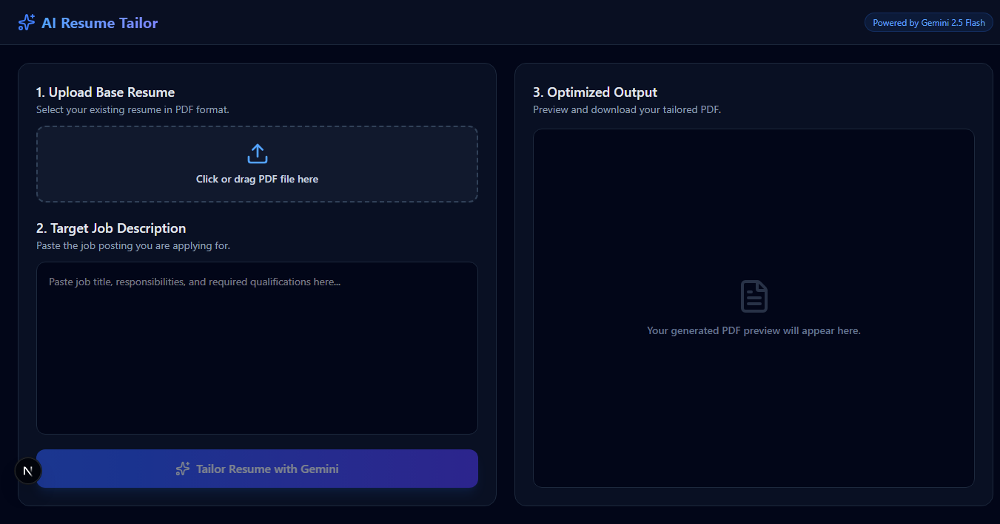

# 📄 AI Resume Builder & Tailor

An interactive full-stack web application that uses AI to help users create **professional, ATS-optimized resumes** tailored to specific job descriptions.

Users can provide their basic information and experience, select a professional resume template, and generate polished, job-targeted resume content using **Google Gemini**. The finished resume can be previewed in real time and downloaded as a PDF.

Built with **Next.js, TypeScript, Google Gemini, and React PDF**.

---

## ✨ Features

### 🎨 Multi-Template Resume Engine

Choose between professionally designed resume templates:

- **Modern Minimal** — Clean and ATS-friendly design for corporate and technical roles.
- **Creative Sidebar** — A more visually distinctive layout for design and creative-oriented positions.

### 🤖 AI-Powered Resume Generation

Provide basic information and rough experience notes, and the AI transforms them into:

- Action-oriented bullet points
- Professional descriptions
- Improved wording
- Relevant achievements and metrics
- Polished professional summaries

### 🎯 Job Description Tailoring

Paste a target job description and the application analyzes it to identify:

- Relevant technical skills
- Important keywords
- Soft skills
- Role-specific requirements
- Relevant resume summary points

The generated content is then tailored toward the target position.

### 🧠 Structured AI Responses

The Gemini API uses structured output schemas to ensure that generated responses follow the expected JSON structure.

This makes the AI-generated data predictable and safer to consume within the application.

### 👁️ Live PDF Preview

Resume changes are reflected in a live PDF preview using:

`@react-pdf/renderer`

Users can review the final document before downloading it.

### 📥 PDF Download

Generate and download the completed resume directly from the application as a professional PDF document.

---

## 📸 Screenshot



---

## 🛠️ Tech Stack

| Technology | Purpose |
|---|---|
| **Next.js** | Full-stack React framework |
| **TypeScript** | Type-safe development |
| **React** | User interface |
| **Tailwind CSS** | Styling and responsive UI |
| **Google Gemini API** | AI-powered resume generation and tailoring |
| **@react-pdf/renderer** | Dynamic PDF generation and preview |
| **Lucide React** | UI icons |

---

## 🏗️ Project Structure

```text
ai-resume-builder/
│
├── app/
│   ├── api/
│   │   └── ...                 # Backend API routes
│   │
│   ├── create/
│   │   └── ...                 # Resume creation workflow
│   │
│   ├── global.css              # Global styles
│   ├── layout.tsx              # Root application layout
│   └── page.tsx                # Landing page
│
├── components/
│   └── ResumeDocument.tsx      # PDF resume document & templates
│
├── public/
│   └── ...                     # Static assets
│
├── screenshots/
│   └── demo.png                # Application screenshot
│
├── .env.local                  # Environment variables
├── next.config.ts              # Next.js configuration
├── package.json                # Project dependencies & scripts
├── postcss.config.mjs          # PostCSS configuration
├── tsconfig.json               # TypeScript configuration
└── README.md
